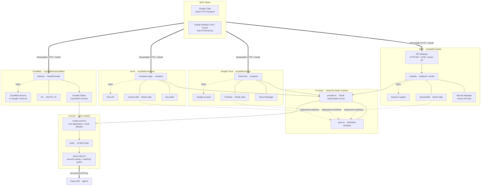
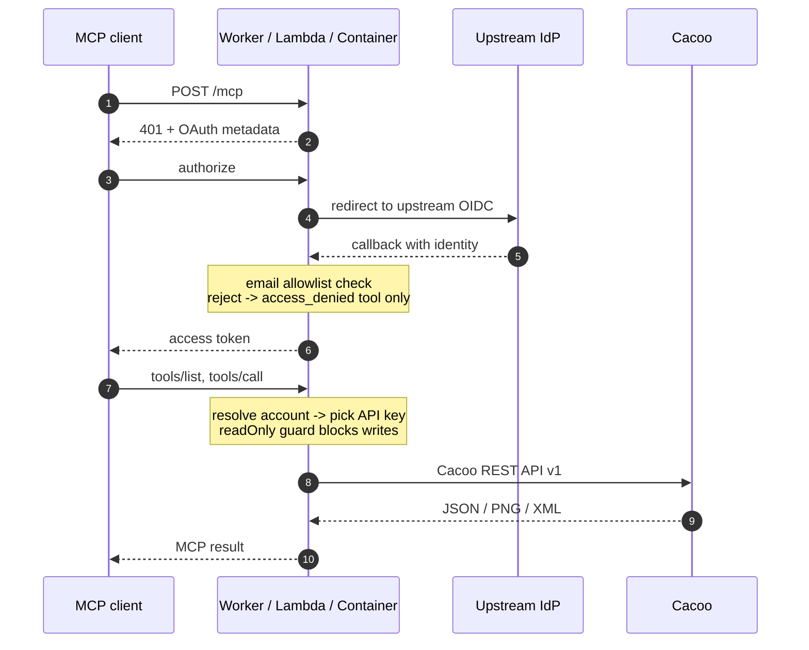

# Cacoo Remote MCP Server

A remote MCP server for the [Cacoo API](https://developer.nulab.com/docs/cacoo/),
deployable to Cloudflare Workers, AWS Lambda, Google Cloud Run or Azure Container Apps.

Unlike a local stdio MCP server, this runs as a hosted HTTP endpoint: you authenticate
once in the browser with OAuth, and your Cacoo API key never leaves the server.

[日本語版はこちら](README_ja.md)

## Features

- **14 MCP tools** covering diagrams, folders, organizations and account information
- **OAuth 2.1 with PKCE** — clients authenticate in the browser; no API key on the client
- **Email allowlist** — application-level authorization on top of the upstream IdP
- **Multiple Cacoo accounts** — route per call, with a per-account read-only guard
- **Four deployment targets** sharing the same tool implementations

## Choosing a deployment

| | Cloudflare | AWS | Google Cloud | Azure |
|---|---|---|---|---|
| Runtime | Workers (edge) | Lambda + API Gateway | Cloud Run | Container Apps |
| MCP session | Durable Objects | Stateless | Stateless | Stateless |
| OAuth authorization server | `@cloudflare/workers-oauth-provider` | `src/oauth` | `src/oauth` | `src/oauth` |
| Upstream IdP | Cloudflare Access | Amazon Cognito | Google account | Microsoft Entra ID |
| State storage | Workers KV | DynamoDB (TTL) | Firestore (TTL) | Cosmos DB (TTL) |
| Secrets | Workers Secrets | Secrets Manager | Secret Manager | Key Vault |
| IaC | wrangler | AWS SAM | Terraform | Bicep |
| Config file | `.dev.vars` | `infra/aws/params.yaml` | `infra/gcp/terraform.tfvars` | `infra/azure/params.json` |

The tools and their behavior are identical on all of them. Every platform can use either
Google or Microsoft Entra ID as its upstream IdP; the table shows the default.

- [Deploying to Cloudflare](docs/deploy-cloudflare.md)
- [Deploying to AWS](docs/deploy-aws.md)
- [Deploying to Google Cloud](docs/deploy-gcp.md)
- [Deploying to Azure](docs/deploy-azure.md)

## Architecture

The same MCP server runs on four platforms. Each platform subgraph holds its own wiring —
gateway, storage and upstream IdP — and the Node-based ones funnel into the shared
`src/oauth`, which in turn uses `src/core`.



### Request flow



Authorization happens in two layers. The upstream IdP decides **who** may sign in, and the
email allowlist decides **who gets tools**: a user outside the allowlist receives a server
exposing only `access_denied`. The `readOnly` flag on an account rejects every non-GET
request in the API client layer, so it cannot be bypassed by an individual tool.

### Directory layout

Three layers, by how widely each one can be reused:

```
src/
  core/                    Every runtime. Depends only on the MCP SDK and zod
    cacoo-client.ts        Cacoo API client (account routing + readOnly guard)
    tools/                 14 MCP tools
    create-server.ts       MCP server assembly and authorization
  oauth/                   Node runtimes. OAuth authorization server (Express)
    provider.ts            OAuthServerProvider implementation
    store.ts               AuthStore interface — the persistence port
    upstream.ts            Upstream OIDC client
    consent.ts             Consent screen
    app.ts                 Express app exposing /authorize, /token, /mcp, ...
  platforms/
    cloudflare/            Workers wiring (uses its own Workers OAuth provider)
    aws/                   Lambda wiring + DynamoDB / Secrets Manager adapters
    gcp/                   Cloud Run wiring + Firestore / Secret Manager adapters
    azure/                 Container Apps wiring + Cosmos DB / Key Vault adapters
infra/
  aws/                     SAM template and parameters
  gcp/                     Terraform configuration
  azure/                   Bicep template and parameters
```

`src/platforms/<name>` is the only place a cloud SDK appears. Adding another Node-hosted
platform means implementing `AuthStore`, a secret lookup, and an entry point that hands
the Express app to the runtime.

## Configuration

Accounts are configured as a single JSON string, `CACOO_ACCOUNTS_CONFIG`.
See **[Cacoo API keys and account configuration](docs/cacoo.md)** for how to issue a
key and find your `organizationKey`.

```json
{
  "accounts": [
    { "name": "main", "apiKey": "xxx", "organizationKey": "your-org-key" },
    { "name": "shared", "apiKey": "yyy", "readOnly": true }
  ],
  "defaultAccount": "main"
}
```

| Field | Meaning |
|---|---|
| `name` | Name used by the `account` argument on every tool |
| `apiKey` | Cacoo API key. Generate one at https://cacoo.com/profile/api |
| `organizationKey` | Default organization for diagram and folder tools. Required on non-legacy plans; tools can override it per call |
| `readOnly` | When true, every non-GET call is rejected |
| `baseUrl` | Defaults to `https://cacoo.com` |

## Connecting from MCP Clients

### Claude Code

```bash
claude mcp add --transport http cacoo https://<your-domain>/mcp -s user
```

### Claude Desktop / Kiro / Cursor

```json
{
  "mcpServers": {
    "cacoo": {
      "command": "npx",
      "args": ["mcp-remote", "https://<your-domain>/mcp"]
    }
  }
}
```

A browser opens on first connection and asks you to authenticate.

## Available Tools

### Diagrams

| Tool | Description |
|---|---|
| `list_diagrams` | List diagrams with filtering, sorting and pagination |
| `get_diagram` | Details of one diagram, including sheets and comments |
| `create_diagram` | Create a new empty diagram |
| `copy_diagram` | Copy an existing diagram |
| `move_diagram` | Move a diagram to another folder |
| `delete_diagram` | Delete a diagram |
| `get_diagram_image` | PNG rendering of a diagram or one sheet |
| `get_diagram_contents` | Structured contents (shapes, text, lines) as XML |

### Workspace

| Tool | Description |
|---|---|
| `list_accounts` | Configured accounts, the default, and which allow writes |
| `list_folders` | Folders in the account |
| `list_organizations` | Organizations, including the `key` used as `organizationKey` |
| `get_account` | Profile of the authenticated account |
| `get_license` | License/plan details |
| `get_user` | Public profile of a user by name |

## Security

- **Authentication**: OAuth 2.1 with PKCE (S256) against an upstream IdP
- **Authorization**: `ALLOWED_EMAILS` provides an application-level email allowlist
- **API key protection**: Cacoo API keys stay on the server and are never sent to clients
- **Client consent**: Dynamic Client Registration is open to anyone, so authorization is
  gated behind a consent screen naming the client and its redirect target, with CSRF
  protection. Approvals are keyed on `client_id` + `redirect_uri`
- **Write guard**: accounts marked `readOnly: true` reject every non-GET call. The check
  lives in `src/core/cacoo-client.ts`, so it does not depend on individual tools
- **Dependency cooldown**: `.npmrc` sets `min-release-age=3`, so dependency resolution
  only considers package versions that have been public for at least three days

## Local Development

```bash
npm install
npm run type-check   # all four platforms
npm test             # 108 assertions
```

| Test | Covers |
|---|---|
| `npm run test:cacoo-client` | URL building, `organizationKey` resolution, readOnly guard, error formatting, 4MB image cap |
| `npm run test:tools` | All 14 tools register; allowlist gating |
| `npm run test:oauth` | DCR, PKCE, single-use tokens, scopes, revocation |
| `npm run test:oauth-consent` | HTML escaping, signed cookies, CSRF, approval gate |
| `npm run test:oauth-upstream` | Endpoint resolution for Cognito / Google / Entra ID |

IaC can be validated without cloud credentials:

```bash
npm run aws:validate     # sam validate --lint
npm run gcp:validate     # terraform validate
npm run azure:validate   # az bicep build
```

## Credits

The tool definitions are ported from
[cacoo-mcp-server](https://github.com/midnight480/cacoo-mcp-server) (local stdio).
The remote server architecture is shared with
[backlog-remote-mcp-server](https://github.com/midnight480/backlog-remote-mcp-server).

## License

MIT
