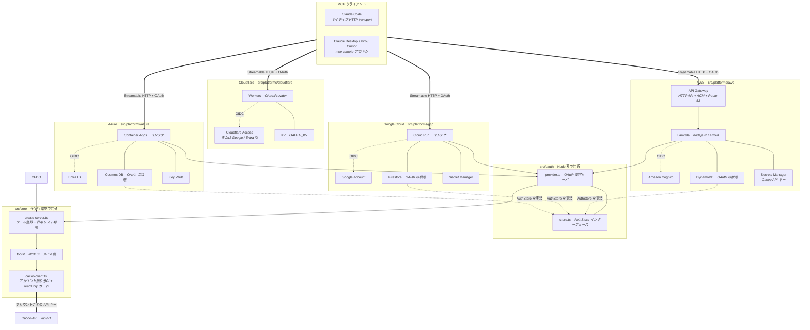
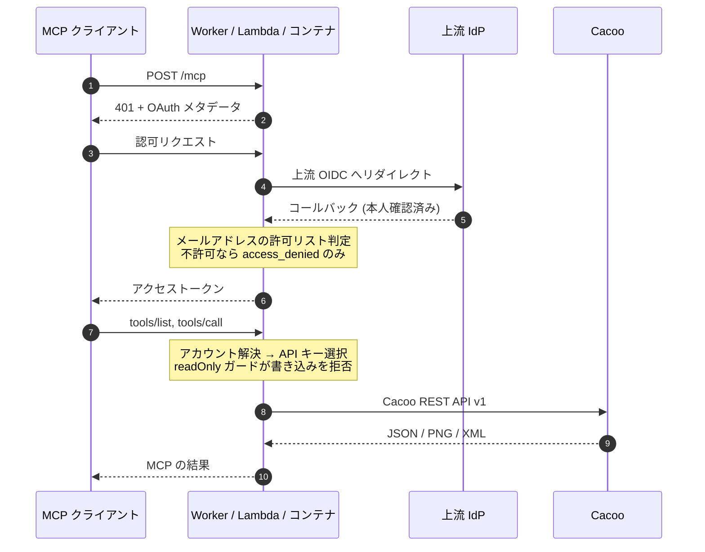

# Cacoo Remote MCP Server

[Cacoo API](https://developer.nulab.com/docs/cacoo/) 向けのリモート MCP サーバです。
Cloudflare Workers / AWS Lambda / Google Cloud Run / Azure Container Apps のいずれにも
デプロイできます。

ローカルの stdio MCP サーバと違い、ホストされた HTTP エンドポイントとして動きます。
認証はブラウザで OAuth を 1 回通すだけで、**Cacoo の API キーはサーバから出ません**。

[English version](README.md)

## 特徴

- **MCP ツール 14 個** — 図・フォルダ・組織・アカウント情報をカバー
- **OAuth 2.1 + PKCE** — ブラウザで認証します
- **メールアドレスの許可リスト** — 上流 IdP に加えたアプリケーション層の認可
- **複数の Cacoo アカウント** — 呼び出しごとに切り替え、アカウント単位の読み取り専用ガード付き
- **利用者ごとの API キーと組織** — 共有のシステムユーザーではなく、操作した本人として Cacoo に記録されます。クライアントが本人のキーと `organizationKey` をリクエストごとに送り、**サーバは Cacoo の資格情報を保存しません** ([詳細](docs/cacoo_ja.md#利用者ごとの-api-キーと組織))
- **4 つのデプロイ先** — ツール実装は共通

## デプロイ先を選ぶ

| | Cloudflare | AWS | Google Cloud | Azure |
|---|---|---|---|---|
| 実行環境 | Workers (エッジ) | Lambda + API Gateway | Cloud Run | Container Apps |
| MCP セッション | ステートレス | ステートレス | ステートレス | ステートレス |
| OAuth 認可サーバ | `@cloudflare/workers-oauth-provider` | `src/oauth` | `src/oauth` | `src/oauth` |
| 上流 IdP | Cloudflare Access | Amazon Cognito | Google アカウント | Microsoft Entra ID |
| 状態保存 | Workers KV | DynamoDB (TTL) | Firestore (TTL) | Cosmos DB (TTL) |
| シークレット | Workers Secrets | Secrets Manager | Secret Manager | Key Vault |
| IaC | wrangler | AWS SAM | Terraform | Bicep |
| 設定ファイル | `.dev.vars` | `infra/aws/params.yaml` | `infra/gcp/terraform.tfvars` | `infra/azure/params.json` |

提供されるツールと挙動はどれも同じです。上流 IdP はどのプラットフォームでも
Google と Microsoft Entra ID の両方を選べます。表にあるのは既定値です。

- [Cloudflare へのデプロイ](docs/deploy-cloudflare_ja.md)
- [AWS へのデプロイ](docs/deploy-aws_ja.md)
- [Google Cloud へのデプロイ](docs/deploy-gcp_ja.md)
- [Azure へのデプロイ](docs/deploy-azure_ja.md)

## アーキテクチャ

同じ MCP サーバを 4 つのプラットフォームで動かします。プラットフォームごとの配線
(入口・ストレージ・上流 IdP) はそれぞれの枠内で完結し、Node 系は共通の `src/oauth` に
合流して `src/core` を使います。



### リクエストの流れ



認可は 2 段構えです。上流 IdP が「**誰がログインできるか**」を決め、メールアドレスの
許可リストが「**誰にツールを見せるか**」を決めます。許可リスト外のユーザーには
`access_denied` だけを持つサーバが返ります。アカウントの `readOnly` は API 呼び出し層で
GET 以外を拒否するため、個々のツール実装に穴があっても迂回できません。

### ディレクトリ構成

再利用できる範囲で 3 層に分かれています。

```
src/
  core/                    全実行環境で共通。MCP SDK と zod にしか依存しない
    cacoo-client.ts        Cacoo API クライアント (アカウント振り分け + readOnly ガード)
    credentials.ts         利用者ごとの API キーと組織の解析・重ね合わせ
    tools/                 MCP ツール 14 個
    create-server.ts       MCP サーバの組み立てと認可判定
  oauth/                   Node 系の実行環境で共通。OAuth 認可サーバ (Express)
    provider.ts            OAuthServerProvider の実装
    store.ts               AuthStore インターフェース (永続化の差し替え点)
    upstream.ts            上流 OIDC クライアント
    consent.ts             同意画面
    app.ts                 /authorize /token /mcp などを載せた Express アプリ
  platforms/
    cloudflare/            Workers 向けの配線 (Workers 専用の OAuth 実装を使う)
    aws/                   Lambda 向けの配線 + DynamoDB / Secrets Manager アダプタ
    gcp/                   Cloud Run 向けの配線 + Firestore / Secret Manager アダプタ
    azure/                 Container Apps 向けの配線 + Cosmos DB / Key Vault アダプタ
infra/
  aws/                     SAM テンプレートとパラメータ
  gcp/                     Terraform の設定
  azure/                   Bicep テンプレートとパラメータ
```

`src/platforms/<name>` がクラウドの SDK を持つ唯一の場所です。Node が動く別の
プラットフォームを足す場合は、`AuthStore` の実装・シークレット取得・Express アプリを
実行環境に渡すエントリポイントを書けば済みます。

## 設定

アカウントは `CACOO_ACCOUNTS_CONFIG` という 1 つの JSON 文字列で設定します。
API キーの発行方法と `organizationKey` の調べ方は
**[Cacoo の API キーとアカウント設定](docs/cacoo_ja.md)** を参照してください。

```json
{
  "accounts": [
    { "name": "main", "apiKey": "xxx", "organizationKey": "your-org-key" },
    { "name": "shared", "apiKey": "yyy", "readOnly": true }
  ],
  "defaultAccount": "main"
}
```

| フィールド | 内容 |
|---|---|
| `name` | 各ツールの `account` 引数で指定する名前 |
| `apiKey` | Cacoo の API キー。https://cacoo.com/profile/api で発行 |
| `organizationKey` | 図・フォルダ系の既定の組織。レガシープラン以外では必須。ツール引数で上書き可 |
| `readOnly` | true にすると GET 以外をすべて拒否する |
| `baseUrl` | 既定は `https://cacoo.com` |

## MCP クライアントからの接続

### Claude Code

```bash
claude mcp add --transport http cacoo https://<あなたのドメイン>/mcp -s user
```

### Claude Desktop / Kiro / Cursor

```json
{
  "mcpServers": {
    "cacoo": {
      "command": "npx",
      "args": ["mcp-remote", "https://<あなたのドメイン>/mcp"]
    }
  }
}
```

初回接続時にブラウザが開き、認証を求められます。

### Claude Desktop (.mcpb バンドル)

上の JSON を手で書く代わりに、`.mcpb` (MCP Bundle) をダブルクリックで
インストールできます。デプロイ時に自動生成され、`dist/` に出力されます。

```bash
npm run mcpb:pack   # 単体で生成
npm run aws:deploy  # デプロイのついでに生成
```

エンドポイント URL は `user_config` になっており、デプロイ先のドメインが既定値として
埋め込まれます。解決順は `--host` 引数 > `MCP_HOSTNAME` 環境変数 >
`infra/aws/params.yaml` の `ApiDomainName` > `.dev.vars` の `MCP_HOSTNAME` です。

**バンドルにサーバ本体は入っていません。** MCPB はローカル実行専用の形式なので、
`mcp-remote` を stdio プロキシとして同梱し、そこからデプロイ済みのサーバへ繋ぎます。
Claude Code はこのバンドルを使いません (`claude mcp add --transport http` のまま)。

## 利用可能なツール

### 図 (Diagram)

| ツール | 説明 |
|---|---|
| `list_diagrams` | 図の一覧。絞り込み・並び替え・ページングに対応 |
| `get_diagram` | 図 1 件の詳細 (シートとコメントを含む) |
| `create_diagram` | 空の図を新規作成 |
| `copy_diagram` | 既存の図を複製 |
| `move_diagram` | 図を別のフォルダへ移動 |
| `delete_diagram` | 図を削除 |
| `get_diagram_image` | 図 (または 1 シート) の PNG |
| `get_diagram_contents` | 図の構造 (図形・テキスト・線) を XML で取得 |

### ワークスペース

| ツール | 説明 |
|---|---|
| `list_accounts` | 設定済みアカウント、既定、書き込み可否 |
| `list_folders` | フォルダ一覧 |
| `list_organizations` | 組織一覧。`key` が `organizationKey` になる |
| `get_account` | 認証中アカウントのプロフィール |
| `get_license` | ライセンス/プランの詳細 |
| `get_user` | ユーザー名から公開プロフィールを取得 |

## セキュリティ

- **認証**: 上流 IdP に対する OAuth 2.1 + PKCE (S256)
- **認可**: `ALLOWED_EMAILS` によるアプリケーション層の許可リスト。
  **空にすると許可リストが無効になり**、上流 IdP を通れた人全員が全ツールを使えます
- **API キー保護**: Cacoo の API キーはサーバに留まり、クライアントへ送られない
- **クライアント同意**: 動的クライアント登録 (DCR) は誰でも叩けるため、認可の前に
  同意画面でクライアント名とリダイレクト先を提示し、CSRF 保護付きの承認を要求する。
  承認は `client_id` + `redirect_uri` の組で記録する
- **書き込みガード**: `readOnly: true` のアカウントは GET 以外を拒否する。判定は
  `src/core/cacoo-client.ts` で行うため、個々のツール実装に依存しない
- **依存のクールダウン**: `.npmrc` で `min-release-age=3` を設定し、公開から 3 日以上
  経ったバージョンだけを依存解決の対象にする

## ローカル開発

```bash
npm install
npm run type-check   # 4 プラットフォーム分
npm test             # 108 件
```

| テスト | 対象 |
|---|---|
| `npm run test:cacoo-client` | URL 組み立て、`organizationKey` の解決、readOnly ガード、エラー整形、画像 4MB 上限 |
| `npm run test:tools` | 14 ツールの登録、許可リストによる出し分け |
| `npm run test:oauth` | DCR、PKCE、トークンの使い捨て、スコープ、失効 |
| `npm run test:oauth-consent` | HTML エスケープ、署名 Cookie、CSRF、承認ゲート |
| `npm run test:oauth-upstream` | Cognito / Google / Entra ID のエンドポイント解決 |
| `npm run test:credentials` | 利用者ごとのキー・組織ヘッダの解析、重ね合わせ、綴り違いを黙って通さないこと |
| `npm run test:user-credentials` | 本人のキーと組織が Cacoo への発信リクエストに乗るまでの通し確認 |

IaC はクラウドの認証情報なしで検証できます。

```bash
npm run aws:validate     # sam validate --lint
npm run gcp:validate     # terraform validate
npm run azure:validate   # az bicep build
```

## クレジット

ツール定義は [cacoo-mcp-server](https://github.com/midnight480/cacoo-mcp-server)
(ローカル stdio 版) から移植しました。リモートサーバの構成は
[backlog-remote-mcp-server](https://github.com/midnight480/backlog-remote-mcp-server)
と共通です。

## ライセンス

MIT
